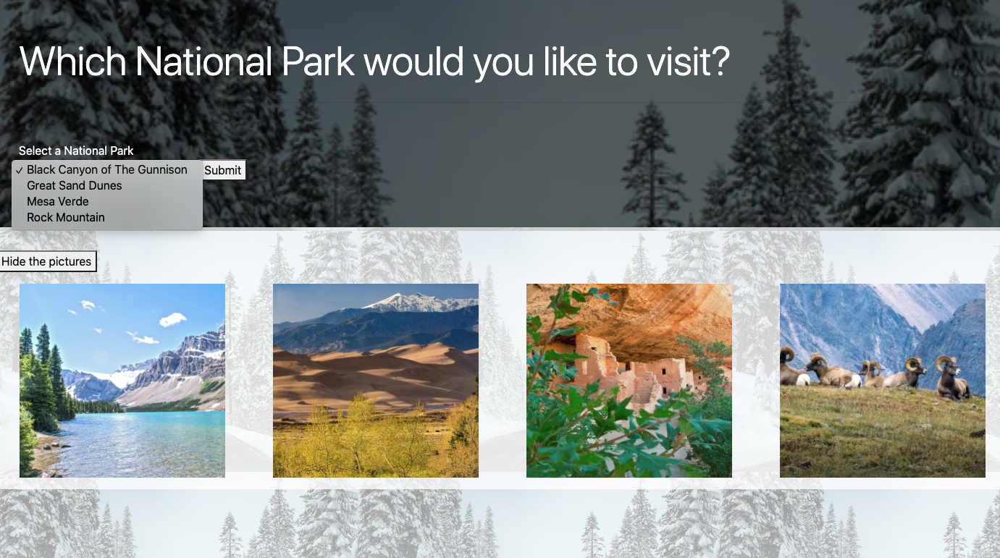
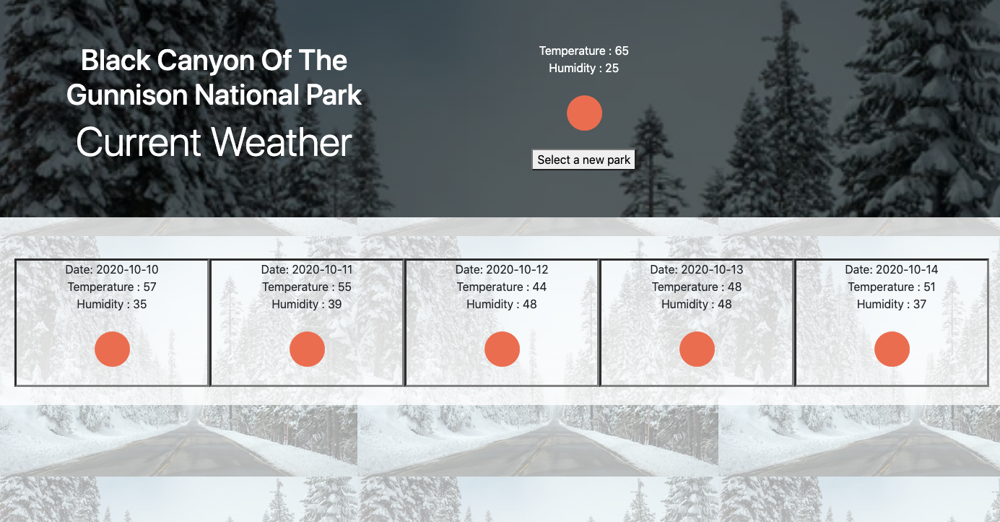

# dubootcampProjectOne

## Description

Using HTML, CSS, Bootstrap, and Javascript, we created an application that allows the user to select a national park, and see information about the park as well as a picture. They can also view the weather for the park.

## Usage

Select a park from the dropdown to view information and a picture. 

Hit the weather button when you are ready to move on

Then youll be able to view the 5 day forecast. If you would like to look at another park click the 'Select next park' button.

## Link to Application

https://tmessall.github.io/dubootcampProjectOne/